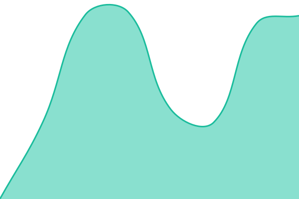
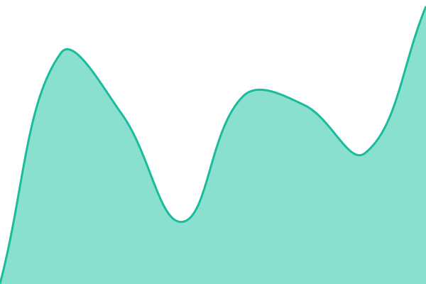
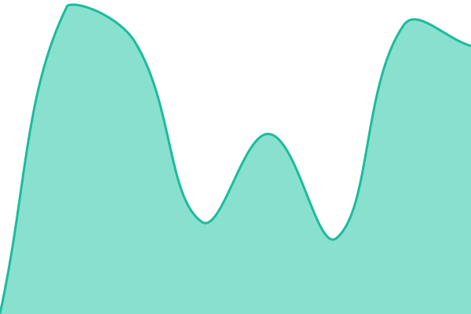
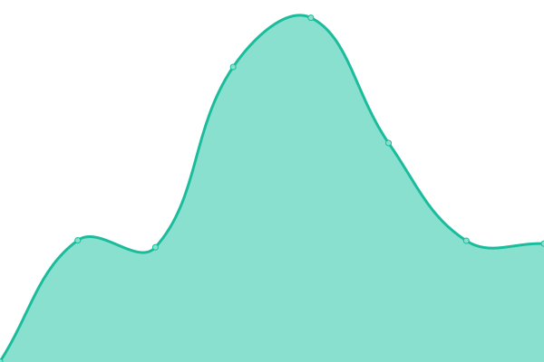
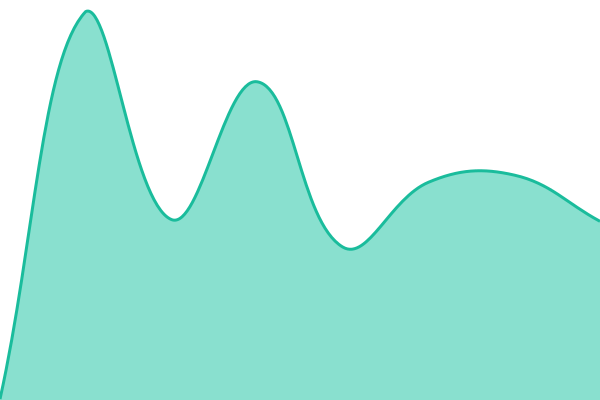

# [📈 Live Status](https://status.gioia.cloud): <!--live status--> **🟧 Partial outage**

Status page and uptime monitor for [my self hosted services](https://andrewgioia.com), powered by [Upptime](https://github.com/upptime/upptime).

With [Upptime](https://upptime.js.org), you can get your own unlimited and free uptime monitor and status page, powered entirely by a GitHub repository. We use [Issues](https://github.com/andrewgioia/status/issues) as incident reports, [Actions](https://github.com/andrewgioia/status/actions) as uptime monitors, and [Pages](https://status.gioia.cloud) for the status page.

<!--start: status pages-->
<!-- This summary is generated by Upptime (https://github.com/upptime/upptime) -->
<!-- Do not edit this manually, your changes will be overwritten -->
<!-- prettier-ignore -->
| URL | Status | History | Response Time | Uptime |
| --- | ------ | ------- | ------------- | ------ |
|  [Gioia Cloud](https://gioia.cloud) | 🟩 Up | [gioia-cloud.yml](https://github.com/andrewgioia/status/commits/HEAD/history/gioia-cloud.yml) | 

 463ms
     
 | 

<a href="https://status.gioia.cloud/history/gioia-cloud">100.00%</a>
    

|  [Gioia Social](https://gioia.social/api/v2/instance) | 🟩 Up | [gioia-social.yml](https://github.com/andrewgioia/status/commits/HEAD/history/gioia-social.yml) | 

 370ms
     
 | 

<a href="https://status.gioia.cloud/history/gioia-social">100.00%</a>
    

|  [Gioia Photos](https://gioia.photos) | 🟩 Up | [gioia-photos.yml](https://github.com/andrewgioia/status/commits/HEAD/history/gioia-photos.yml) | 

 357ms
     
 | 

<a href="https://status.gioia.cloud/history/gioia-photos">100.00%</a>
    

|  [Gioia Chat](https://element.gioia.chat) | 🟩 Up | [gioia-chat.yml](https://github.com/andrewgioia/status/commits/HEAD/history/gioia-chat.yml) | 

 449ms
     
 | 

<a href="https://status.gioia.cloud/history/gioia-chat">100.00%</a>
    

|  [Gioia News](https://gioia.news) | 🟥 Down | [gioia-news.yml](https://github.com/andrewgioia/status/commits/HEAD/history/gioia-news.yml) | 

 529ms
     
 | 

<a href="https://status.gioia.cloud/history/gioia-news">100.00%</a>
    

|  [Gioia Git](https://git.gioia.cloud/) | 🟩 Up | [gioia-git.yml](https://github.com/andrewgioia/status/commits/HEAD/history/gioia-git.yml) | 

 216ms
     
 | 

<a href="https://status.gioia.cloud/history/gioia-git">100.00%</a>
    

<!--end: status pages-->

[**Visit our status website →**](https://status.gioia.cloud)

## 📄 License

- Powered by: [Upptime](https://github.com/upptime/upptime)
- Code: [MIT](./LICENSE) © [Anand Chowdhary](https://anandchowdhary.com), supported by [Pabio](https://pabio.com)
- Data in the `./history` directory: [Open Database License](https://opendatacommons.org/licenses/odbl/1-0/)
